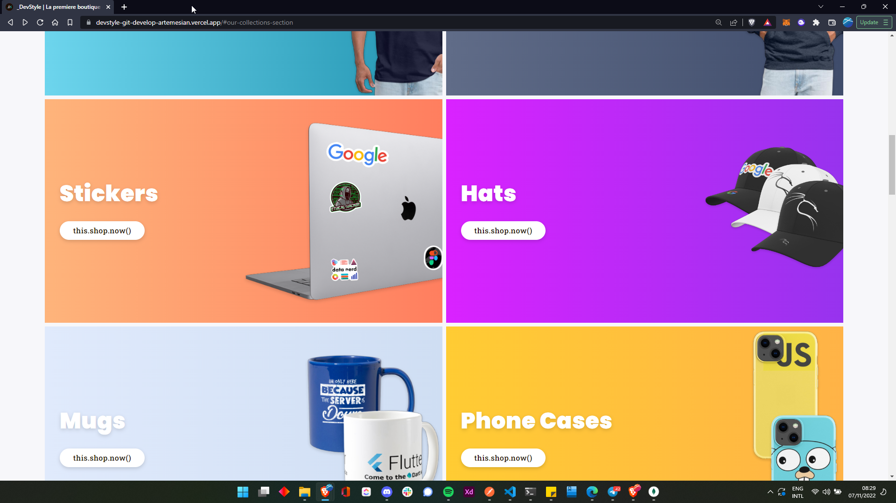
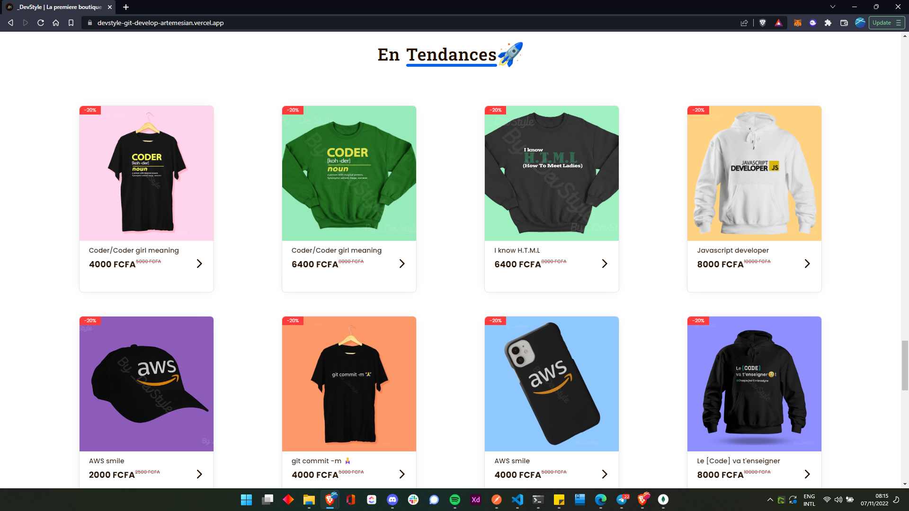
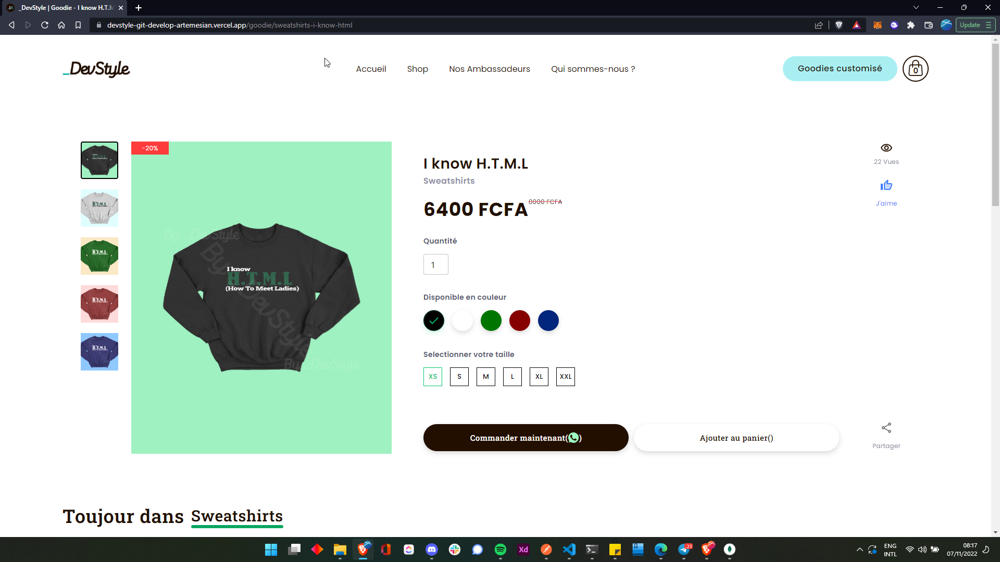
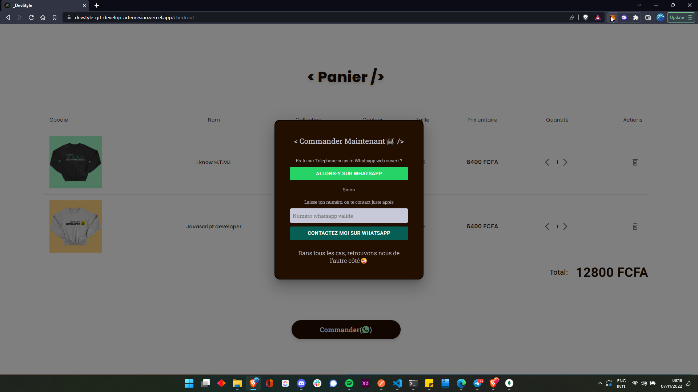
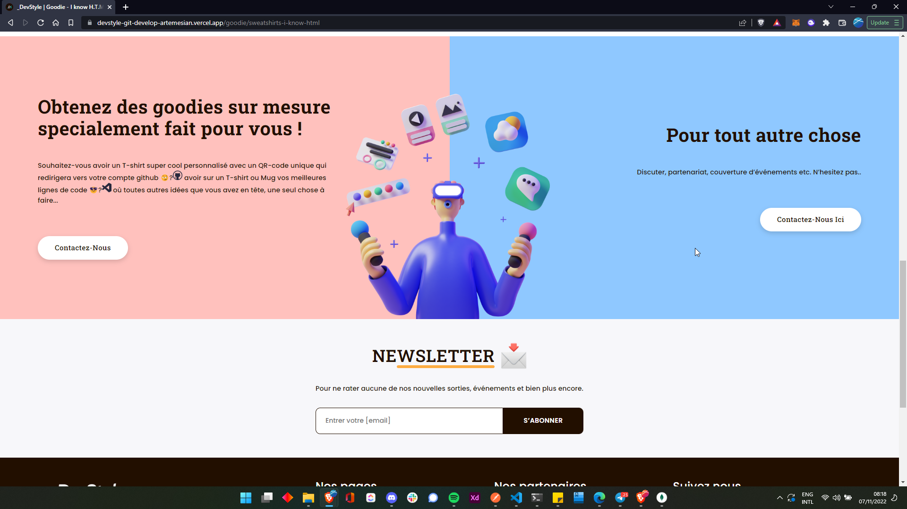

<!--rehype:ignore:start-->

<p align="center">
<p align="center">
  <a href="https://dev-style.com">
    
  </a>
  <br/>
  <span>#Being a Developer, More Than a Job, It's a Lifestyle.</span>
  <p align="center" style="text-align: center;font-size: 20px;">
  🛍️👨🏽‍💻🚀🌐
  </p>
</p>
</p>

<!--rehype:ignore:end-->

## Vision💙

\_DevStyle aims to build a supportive, dynamic and fun Techx (fans of technology) community sharing the same passion for technology as you, and above all, we aim to establish a vibrant ecosystem for Techx in Cameroon 🇨🇲, by implementing the following objectives : Frequent Meets & Talks Events, Hackathons & Competitions and much more to come...⌛

_TL;DR_

```markdown
# Bring Together - Educate - Dynamise
```

## E-commerce website

This e-commerce website leverages original, creative, fun designs, graphics and slogans, meticulously crafted on `Clothings` & `Accessories` to set techx apart and connect techx to their passion for **Technology**. Techx can order clothings like `Shirts`, `Hoodies`, `Sweat-shirts` to more unique items like `Phone cases`, `Hats`, `Mugs`, `Posters` & `Stickers` and much more, that will best reflect and express the passion they have for Technology.

### Features

- View a `collection` and its corresponding `goodies`.
- View a goodie, like a goodie, simple available button to copy goodie link to easily share with friends.
- Add goodie to cart.
- Immediate ordering of a goodie through the `order now button` which redirects to Devstyle's whatsapp account.
- Side opening cart and cart page.
- Delete and edit number goodies in cart page.
- Submit customise goodie idea or contact for partnership via whatsapp link in Custom section
- List Devstyle `Ambassadors`
- About page

### Backend project repo

[⚙️Devstyle backend here](https://github.com/artemesian/devstyle-backend)

### Tech

#### Front End

- [React](https://reactjs.org/) - UI Library
- [Material ui](https://mui.com/) - React UI toolkit
- [React router dom](https://reactrouter.com/en/main) - Routing
- [React redux](https://react-redux.js.org/) - State manaagement
- [React toastify](https://fkhadra.github.io/react-toastify/) - Notifications
- [Axios](https://axios-http.com/) - HTTP client

#### Back End

- [Express](https://expressjs.com/) - Web Framework for Node.js
- [MongoDB](https://www.mongodb.com/) - Non-Relational Database
- [NodeJS](https://nodejs.org/) - Runtime Environment

## Quick Start

### Requirements

- npm
- create-react-app

### Clone the repository

```fish
git clone https://github.com/artemesian/devstyle.git

cd devstyle
```

### How to install

You just have to run :

```fish
# Using npm
npm install
```

### Set connection mode

if in **production mode**, uncomment `prodURL` and comment `devURL` else _vice-versa_

```jsx mdx:preview
import axios from "axios";

const devURL = "http://localhost:5000";
// const prodURL = "https://devstyle.herokuapp.com/";

// Set config defaults when creating the instance
const myAxios = axios.create({
  baseURL: devURL,
  // baseURL: prodURL,
});

export default myAxios;
```

### Start react server

```fish
npm start
```

### Application will be running on

[http://localhost:3000](http://localhost:3000)

## How to contribute

Just follow these steps :

- Create an issue with your fix/feature/improvement (Optionnal but recommended).
- Fork the project.
- Create a branch for your feature/update/fix(Make sure to have the latest master-branch updates).
- Create a Pull Request to develop branch.
- After a check, it will be merged to the project.

## Some Screenshots

<p align="center">






</p>

## Author

[Artemesian](https://github.com/artemesian)

## Join the Community💙

<p align="left">
  <a href="https://twitter.com/_devstyle">
    
  </a>
  &nbsp;
  &nbsp;
  <a href="https://discord.gg/anBNJBsP">
    
  </a>
  &nbsp;
  &nbsp;
  <a href="https://api.whatsapp.com/send/?phone=237692650993&text=Hello%20_DevStyle">
    
  </a>
  &nbsp;
  &nbsp;
   <a href="https://www.facebook.com/devstyl">
    
  </a>
  &nbsp;
  &nbsp;
  <a href="https://www.instagram.com/_devstyle/">
    
  </a>
  &nbsp;
  &nbsp;
  <a href="https://www.tiktok.com/@_devstyle">
    
  </a>
</p>
